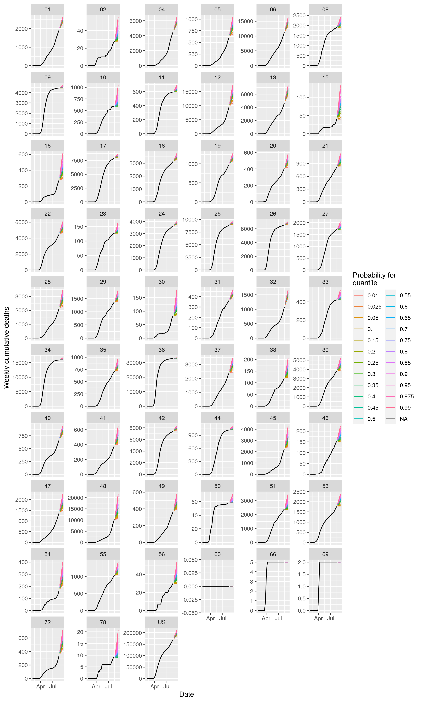
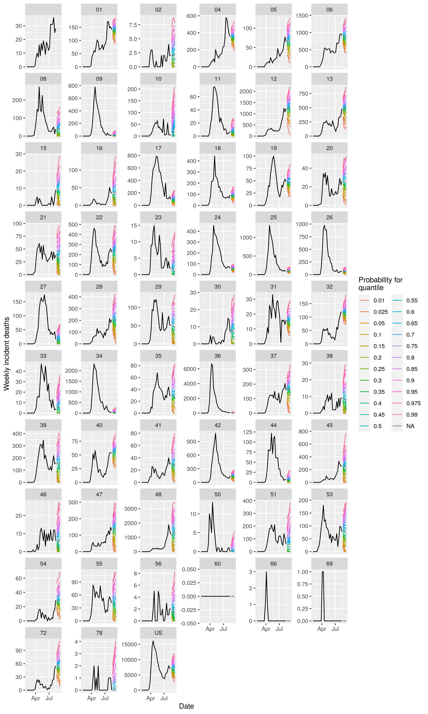

This repository contains the code of a simple forecaster for [the COVID 19 forecast hub](https://covid19forecasthub.org/), which collects forecasts of COVID 19 indicators,
such as official reports of deaths and cases, in a standardized format. 

In brief, this forecaster assumes that the next few weeks of any time series of indicators
will have a similar trend and spread as the last few weeks. In more detail, a straight line is 
fit to the last few data points of either incident cases or incident deaths by minimizing squared error (the squared vertical distance between the
line and the points). The slope of the line determines the expected value of a step
in a random walk, and the squared error determines the variation around this expected value in the walk. 
Steps in the walk are determined by sampling from a normal distribution. But if the walk drifts below
zero, it is reflected back upward. By simulating these walks repeatedly, a distribution of future values
of incident cases and deaths are obtained. A distribution of cumulative deaths is derived from the distribution 
of incident deaths. 

This forecaster is far from optimal but it performs better than 
one might guess. Its performance may serve as a useful benchmark for more advanced forecasters. Visualizations of the deaths forecasts are below, and a PDF file with forecasts of cases for national, state, and county locations, is [here](https://github.com/e3bo/random-walks/raw/dev/visuals/fdt2020-08-16-ddt2020-08-16-inc-case-forecasts.pdf). The number above each plot panel is a FIPS code for the location. We hope to provide nicer visualizations with names of the locations soon.

