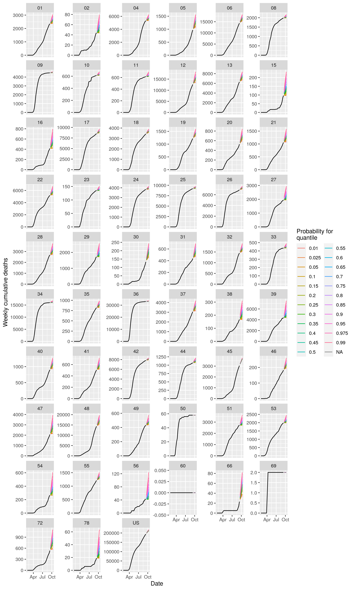
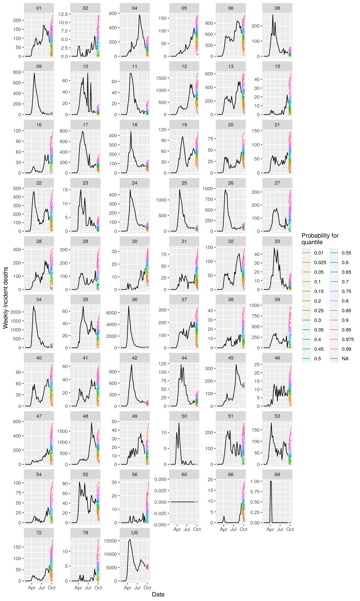

This repository contains the code of a simple forecaster for [the COVID 19 forecast hub](https://covid19forecasthub.org/), which collects forecasts of COVID 19 indicators,
such as official reports of deaths and cases, in a standardized format. 

In brief, this forecaster assumes that the next few weeks of any time series of indicators
will have the same spread as the last few weeks and will be centered on the last observation.
Steps in the random walk have an expected value of zero and the standard devation of the last few data points determines the variation around zero in the step size. 
Steps in the walk are determined by sampling from a normal distribution. If the walk drifts below
zero, it is considered to be at zero for the purpose of predicting the indicator. By simulating these walks repeatedly, a distribution of future values
of incident cases and deaths are obtained. A distribution of cumulative deaths is derived from the distribution 
of incident deaths. 

This forecaster is far from optimal but it performs better than 
one might guess. Its performance may serve as a useful benchmark for more advanced forecasters. Visualizations of the deaths forecasts are below, and a PDF file with forecasts of cases for national, state, and county locations, is [here](https://github.com/e3bo/random-walks/raw/master/visuals/fdt2020-09-13-ddt2020-09-13-inc-case-forecasts.pdf). The number above each plot panel is a FIPS code for the location. We hope to provide nicer visualizations with names of the locations soon.

